<h1>Mohd Shadman</h1>

  

  

***

### 🛠 Tech Stack

 

***

### 📊 GitHub Stats

***

### 🚀 Featured Projects

#### [Multithreaded Chat Server](https://github.com/leoshad9/multithreaded-chat-server)
Production-ready TCP/IP chat server built with Java socket programming. Features concurrent client handling, real-time message broadcasting, and thread-safe operations.

**Tech:** Java • Socket Programming • TCP/IP • Multithreading • Networking

#### [Image Encryption & Decryption Tool](https://github.com/leoshad9/image-encryption-decryption)
Desktop application for secure image encryption using Python. Features Tkinter GUI, substitution cipher with random key generation, and efficient NumPy-based pixel transformations.

**Tech:** Python • Tkinter • NumPy • Matplotlib • Cryptography
