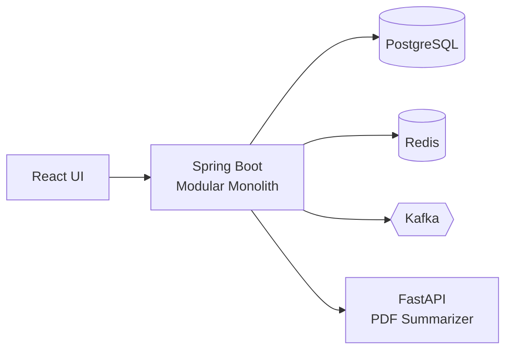

  

  
  
  

---

### 👋 About Me

I'm a backend engineer who builds reliable APIs and event-driven services. My foundation is **Java and Spring Boot**, and I'm extending it into **NestJS and TypeScript** microservices. I care about production concerns: fault tolerance, caching, observability, and deployments that don't need babysitting.

- 🔧 **Day to day:** REST APIs, microservices, async messaging, PostgreSQL, Redis
- 🌱 **Currently deepening:** NestJS/TypeScript service design alongside Java/Spring Boot
- ✍️ **Also into:** writing about backend engineering and security
- 💬 **Ask me about:** Spring Boot, Kafka workflows, Resilience4j, Dockerised deployments on AWS EC2

---

### 🛠 Tech Stack

<table>
  <tr>
    <td><b>Languages</b></td>
    <td></td>
  </tr>
  <tr>
    <td><b>Backend</b></td>
    <td></td>
  </tr>
  <tr>
    <td><b>Frontend</b></td>
    <td></td>
  </tr>
  <tr>
    <td><b>Data &amp; Messaging</b></td>
    <td></td>
  </tr>
  <tr>
    <td><b>Cloud &amp; DevOps</b></td>
    <td></td>
  </tr>
  <tr>
    <td><b>Observability &amp; Tools</b></td>
    <td></td>
  </tr>
</table>

---

### 🚀 Featured Projects

#### 🏥 [MedOps: Hospital Operations Platform](https://github.com/leoshad9/medops) &nbsp;·&nbsp; [🌐 Live Demo](https://medops.duckdns.org/)

Full-stack healthcare operations platform for secure clinical workflows, appointment management, and AI-assisted report summarization.

- 🔐 **Security:** JWT authentication with role-based access control (RBAC)
- 📨 **Event-driven:** Kafka-backed workflows for decoupled processing
- ⚡ **Performance:** Redis caching on hot read paths
- 🛡️ **Resilience:** Resilience4j circuit breakers and fault tolerance
- 🤖 **AI service:** FastAPI microservice that summarizes clinical PDFs
- 🚢 **Delivery:** Dockerised and deployed on AWS EC2 through GitHub Actions

```mermaid
flowchart LR
    UI[React UI] --> API[Spring Boot<br/>Modular Monolith]
    API --> DB[(PostgreSQL)]
    API --> Cache[(Redis)]
    API --> K{{Kafka}}
    API --> AI[FastAPI<br/>PDF Summarizer]
```

**Tech:** `Java 21` `Spring Boot` `React` `PostgreSQL` `Redis` `Kafka` `FastAPI` `Docker` `AWS EC2` `GitHub Actions`

 

<table>
  <tr>
    <td width="50%" valign="top">
      <h4><a href="https://github.com/leoshad9/multithreaded-chat-server">💬 Multithreaded Chat Server</a></h4>
      Concurrent TCP/IP chat server with multi-client support, real-time broadcasting, and thread-safe operations.
        
      <b>Tech:</b> <code>Java</code> <code>Sockets</code> <code>TCP/IP</code> <code>Multithreading</code>
    </td>
    <td width="50%" valign="top">
      <h4><a href="https://github.com/leoshad9/image-encryption-decryption">🔒 Image Encryption Tool</a></h4>
      Desktop app for reversible image encryption using pixel-level transformations, with a Tkinter GUI.
        
      <b>Tech:</b> <code>Python</code> <code>Tkinter</code> <code>NumPy</code> <code>Matplotlib</code>
    </td>
  </tr>
</table>

---

### 📊 GitHub Stats

  
  

---

### 📫 Let's Connect

I'm always happy to talk backend architecture, distributed systems, or interesting engineering problems. The quickest way to reach me is [LinkedIn](https://www.linkedin.com/in/shadman-leoshad9/) or [my portfolio](https://leoshad9.github.io).

